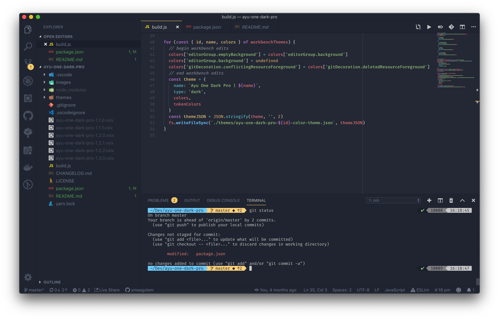

# Ayu One Dark Pro (deprecated)

**Note:** This extension has been **deprecated** in favour of [One Dark Pro](https://marketplace.visualstudio.com/items?itemName=zhuangtongfa.Material-theme) `3.0.0` as it now includes dynamic theming with **ayu** as an option.

How to get the same appearance (Mirage Bordered):
- Install [One Dark Pro](https://marketplace.visualstudio.com/items?itemName=zhuangtongfa.Material-theme).
- Edit your `settings.json` so it matches the following:

```json
{
    "workbench.colorTheme": "One Dark Pro",
    "oneDarkPro.editorTheme": "ayu",
    "oneDarkPro.bold": true,
    "editor.tokenColorCustomizations": {
        "[One Dark Pro]": {
            "textMateRules": [
                {
                    "name": "js object key",
                    "scope": "meta.object-literal.key",
                    "settings": {
                        "foreground": "#56b6c2"
                    }
                }
            ]
        }
    }
}
```

Thanks to those who used this extension. 🙏 
_Bye bye_ now! 👋

---
---

> Color Theme for [Visual Studio Code](https://code.visualstudio.com/)

Combination of [Ayu](https://github.com/ayu-theme/vscode-ayu) and [One Dark Pro](https://github.com/Binaryify/OneDark-Pro) with a few edits for myself.

Includes the four dark Ayu workbench themes:

- Mirage
- Mirage Bordered
- Dark
- Dark Bordered

I personally use **Mirage Bordered**.  
Not too dark, with slight contextual borders 👌



The syntax highlighting is One Dark Pro **Bold**.  
So, **methods()** are bold, and I've change javascript object keys to be aqua instead of red.  
There was way too much red.

Bye.

Release checklist because I forget things:

- Upgrade dependencies
- Bump version
- Update changelog details
- Update changelog links
- Test package
- Tag
- Push
- Release
- Publish
